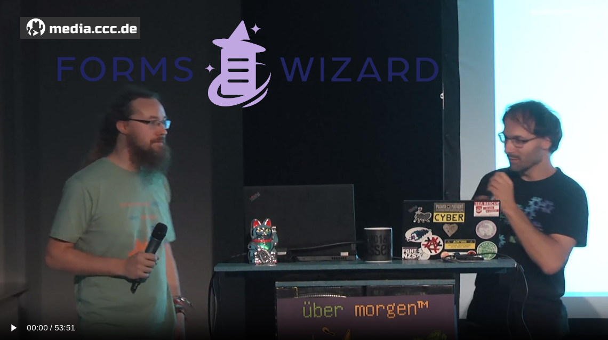

# Forms Wizard — main app

## Quickstart

### Demo Server

The easiest start is by testing our [**`Demo Instance`**](https://formswizard.github.io/formswizard/new)


### Local Build

#### via nix (recommended)

```bash
nix develop
```

#### via docker

*will be provided soon*


## Further reading

* [`Main Repository`](https://github.com/FormsWizard/formswizard)
* [`Official Documentation`](https://github.com/FormsWizard/formswizard/blob/main/doc/src/SUMMARY.md)  <!-- TODO: Link to rendered mdBook as github-page -->
* [`Wiki`](https://github.com/FormsWizard/formswizard/wiki)

This talk explains FormsWizard (in German language):
[](https://cdn.media.ccc.de/events/datenspuren/2023/h264-hd/ds2023-256-deu-FormsWizard_-_To_be_prepared_for_the_next_crisis_hd.mp4)
