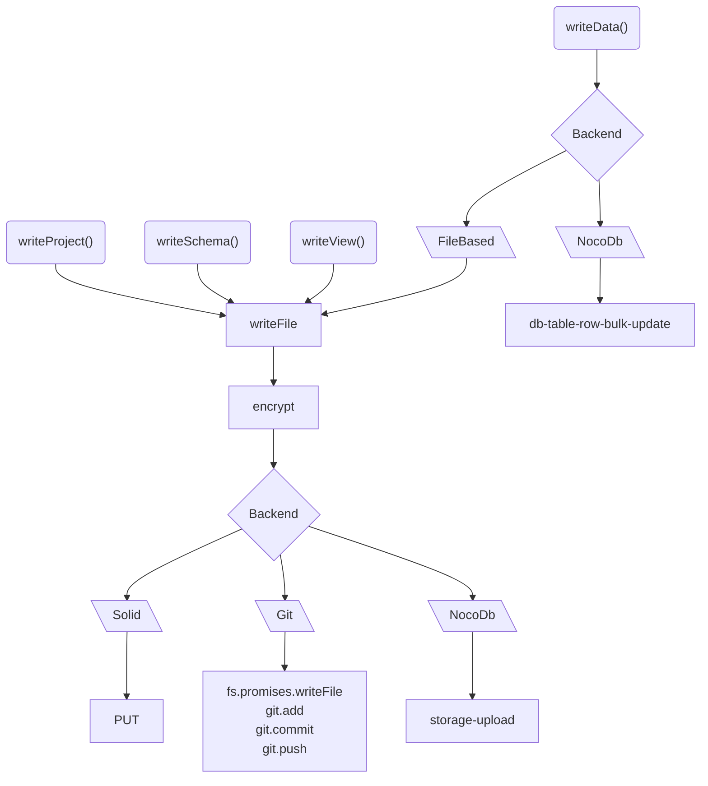

# Backend-Wrapper

```mermaid
flowchart TD
  writeProject("writeProject()") --> writeFile
  writeSchema("writeSchema()") --> writeFile
  writeView("writeView()") --> writeFile
  writeData("writeData()") --> isBackendNocoDb{Backend}
  isBackendNocoDb --> BackendFileBased[\FileBased\]
  isBackendNocoDb --> NocoDb[\NocoDb\]
  NocoDb --> NocoDb_row["db-table-row-bulk-update"]
  BackendFileBased --> writeFile
  writeFile --> encrypt
  encrypt --> whichBackend{Backend}
  whichBackend --> Solid[\Solid\]
  Solid --> PUT
  whichBackend --> Git[\Git\]
  Git --> Git_["fs.promises.writeFile\ngit.add\ngit.commit\ngit.push"]
  whichBackend --> NocoDbStorage[\NocoDb\]
  NocoDbStorage --> NocoDbStorage_["storage-upload"]
```
