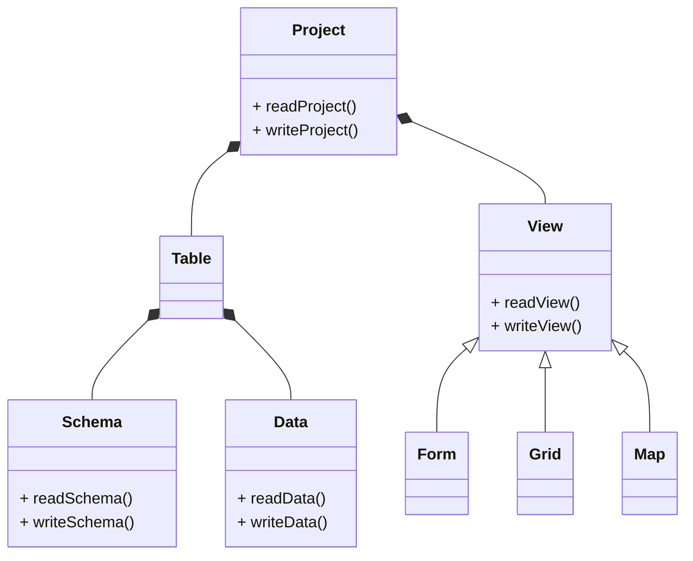

# Datastructures

## Serialization

### Filesystem

A directory structure for storage in a filesystem (Solid, Git) might look like:

<pre>
└─ MyProjekt
   ├─ MyProject.json
   ├─ Tables
   │  ├─ MyTable1.schema.jsonld
   │  ├─ MyTable1.json
   │  ├─ MyTable2.schema.jsonld
   │  ├─ MyTable2.csv
   │  ├─ MyTable3.schema.jsonld
   │  └─ MyTable3.rdf
   └─ Views
      ├─ MyForm1.json
      └─ MyGrid1.json
</pre>

### NocoDB

When using NocoDB as backend, metadata could be stored into an additional NocoDB-Table with a `Content` column of type `json`.

| ID              | Content |
|-----------------|---------|
| project         | {}      |
| MyTable1.schema | {}      |
| MyTable2.schema | {}      |
| MyTable3.schema | {}      |
| MyTable3.data   | {}      |
| MyForm1         | {}      |
| MyGrid1         | {}      |

A better alternative might be using the storage API.

When importing existing NocoDB tables for usage with FormsWizard, the schema must be inferred from NocoDB column types.

To use NocoDB-UI, we want call the API-function for creating a table of types inferred from the schema (whenever a new table is created by FormsWizard). Than data should be stored via API directly into this native NocoDB tables. If NocoDB-UI is not required, but you want use features only supported by FormsWizard (e.g. encryption), data can be stored as metadata.
