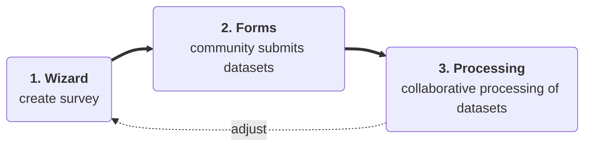
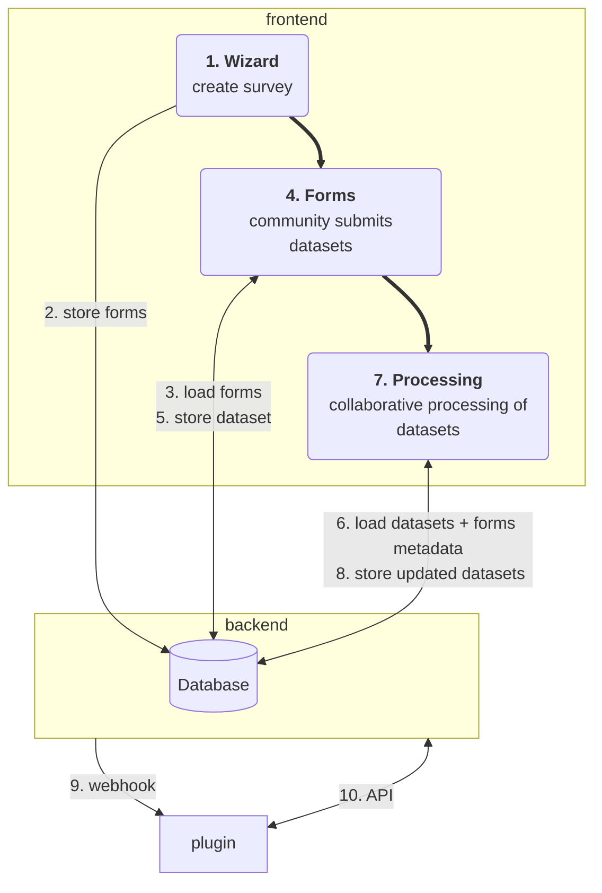

# Overview

## User perspective

From a user perspective, the tool contains of 3 main parts:

1. You create a survey using a graphical user interface.
2. You ask your community to participate in the survey via an invite link. 
   Each member of your community who received the link can fill in the form. This way you can gather knowledge about resources and skills your community is willing to provide or collect information about demands for your collective offers.
3. The survey results are securely stored and available for download whenever you want process them with other tools of your choice. 
   Probably you want evaluate and process the received datasets together with teammates. Therefore we provide a tool which attempts to simplify searching datasets by filtering, sorting and visualizing. Our collaborative online editor allows your team to simultaneously correct and complement datasets. 
   As creator of the survey, it is your choice whom you grant read or write access to the datasets.

When organizing projects based on community provided datasets, you don't want rely on the steps 1.-3. being used linear after each other. After starting to process collected datasets, you may want to adjust the survey (e.g. add additional questions or change the type of a form field). For such situations, we support the processing of mixed datasets, which have been created from different versions of a survey.

## System perspective

